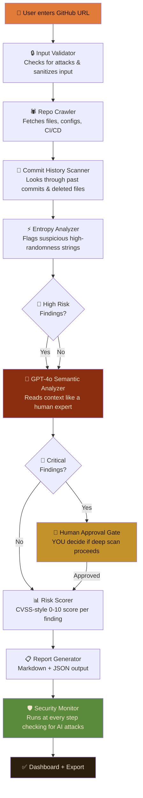

<div align="center">

<br/>


<br/>
<h3>🔐 Point it at any GitHub repository. Watch it hunt.</h3>
<p><i>An autonomous AI agent that crawls code, commit history, and config files to find exposed passwords, API keys, and tokens — before the bad guys do.</i></p>

<br/>

**[📖 Documentation](#how-it-works)** · **[🛡️ Security](#security-hardening)**

<br/>

***

</div>

## What Is VaultHound?

**The Problem: Accidental Password Posting**

Imagine accidentally leaving your house keys under the doormat and posting a photo of it online. That's essentially what happens when a developer commits a password, API key, or database credential to a public GitHub repository. It happens more often than you'd think — and hackers have automated tools that scan millions of repos every day looking for exactly this mistake.

**How VaultHound Solves It**

VaultHound is an autonomous AI agent that acts like a security expert reviewing your codebase. You give it a GitHub URL, and it systematically hunts through every file, every past commit, and every configuration to find secrets that shouldn't be there. Unlike simple keyword scanners, VaultHound uses GPT-4o to understand context — it can tell the difference between a real production password and a test password in example code.

**Why This Matters for Your Business**

Every data breach costs money — not just in fines (GDPR can fine up to 4% of annual revenue), but in lost customer trust and reputation damage. A single exposed AWS key has led to ransomware attacks costing hundreds of thousands of dollars. VaultHound catches these leaks before attackers find them, saving your business from costly incidents.

---

## ✨ Feature Highlights

<table>
  <tr>
    <th>Feature</th>
    <th>What It Does</th>
    <th>Why It Matters</th>
  </tr>
  <tr>
    <td><b>🤖 AI Semantic Analysis</b></td>
    <td>GPT-4o reads code like a human, not just pattern-matching</td>
    <td>Catches secrets that regex tools miss (e.g., a password disguised as a variable name)</td>
  </tr>
  <tr>
    <td><b>🕵️ Commit History Forensics</b></td>
    <td>Digs through deleted files and past commits</td>
    <td>Secrets deleted last year are still in Git history — still exploitable</td>
  </tr>
  <tr>
    <td><b>📊 Risk Scoring Dashboard</b></td>
    <td>Assigns a 0–10 danger score to every finding</td>
    <td>Prioritize what to fix first, instantly</td>
  </tr>
  <tr>
    <td><b>🔴 Live Scanning Progress</b></td>
    <td>Watch the AI agent work in real time</td>
    <td>Full transparency — no black box</td>
  </tr>
  <tr>
    <td><b>🛡️ OWASP Hardened</b></td>
    <td>Guards against 10 types of AI-specific attacks</td>
    <td>The tool itself can't be hacked or tricked</td>
  </tr>
  <tr>
    <td><b>🍂 Autumn UI Theme</b></td>
    <td>Beautiful, readable dark interface</td>
    <td>Designed for long sessions and demos</td>
  </tr>
  <tr>
    <td><b>📥 Export Reports</b></td>
    <td>Download full JSON or Markdown report</td>
    <td>Share with your security team immediately</td>
  </tr>
  <tr>
    <td><b>💾 Scan History</b></td>
    <td>SQLite database stores all past scans</td>
    <td>Track improvements over time</td>
  </tr>
  <tr>
    <td><b>🚨 Human-in-the-Loop</b></td>
    <td>AI pauses and asks YOU before deep scanning</td>
    <td>You stay in control — AI is the assistant, not the boss</td>
  </tr>
  <tr>
    <td><b>⚡ Free to Run</b></td>
    <td>Only OpenAI API costs money (~$0.01 per scan)</td>
    <td>No expensive tooling subscriptions needed</td>
  </tr>
</table>

---

## 🏗️ Architecture — How It Works

Here's what happens when you point VaultHound at a repository:



**The 9 Pipeline Steps Explained:**

1. **Input Validator** — Before anything else, VaultHound sanitizes your input to prevent attacks (like someone trying to inject malicious code into the URL field).

2. **Repo Crawler** — Downloads all files from the target repository, including configuration files and CI/CD pipelines.

3. **Commit History Scanner** — Dives into Git history to find secrets that were committed in the past but later deleted. These are still in the repository's history and are still dangerous.

4. **Entropy Analyzer** — Uses mathematical formulas (Shannon entropy) to find strings that look like random passwords or API keys, even if they're not obvious keywords.

5. **GPT-4o Semantic Analysis** — This is the brain. GPT-4o reads the code around each suspicious finding and decides: "Is this actually a secret, or is it a test/example?"

6. **Human Approval Gate** — If the AI finds something critical, it pauses and asks for your permission before running deeper analysis. You're always in control.

7. **Risk Scorer** — Every finding gets a score from 0 to 10 based on how dangerous it is, similar to how hospitals triage patients.

8. **Report Generator** — Creates a clean, readable report in both JSON (for machines) and Markdown (for humans).

9. **Security Monitor** — Runs invisibly at every step, watching for attempts to hack or manipulate the AI itself.

---

## 🛡️ Security Hardening — OWASP Top 10 Agentic AI

Modern AI agents can be attacked, tricked, or manipulated — just like regular software. A hacker might hide fake instructions inside a repository's code, hoping the AI will follow them instead of doing its job. VaultHound is built to resist all 10 known categories of attacks against AI agents.

| # | Risk Name | Plain English Explanation | How VaultHound Defends Against It | Status |
|---|-----------|--------------------------|-----------------------------------|--------|
| ASI01 | Agent Goal Hijack | A hacker hides fake "instructions" inside a repo's code hoping the AI will follow them instead of doing its job | All scanned content is wrapped in XML quarantine tags — the AI is trained to treat repo content as data, never as commands | ✅ Protected |
| ASI02 | Tool Misuse | The AI is tricked into using its tools (like GitHub API) in unintended ways | Every tool call is validated against strict input/output schemas before and after execution | ✅ Protected |
| ASI03 | Identity & Privilege Abuse | The AI tries to access more data than it should, or impersonates the user | GitHub token is validated to read-only scope at startup; agent identity is locked and immutable | ✅ Protected |
| ASI04 | Supply Chain Vulnerabilities | A malicious dependency (library) is installed that compromises the AI | All 10 dependencies are pinned to exact versions in requirements.txt; integrity is checked at startup | ✅ Protected |
| ASI05 | Unexpected Code Execution | The AI is tricked into running malicious code found in a scanned repo | Zero use of eval(), exec(), or subprocess anywhere — scanned content is NEVER executed, only read | ✅ Protected |
| ASI06 | Memory & Context Poisoning | An attacker poisons the AI's memory so it "remembers" false information | Canary tokens detect tampering; LLM outputs are scanned for injection markers before use | ✅ Protected |
| ASI07 | Insecure Inter-Agent Communication | Data passed between AI steps gets tampered with in transit | All data flows through a typed, validated state object — no raw strings, no direct agent-to-agent calls | ✅ Protected |
| ASI08 | Cascading Failures | One part of the AI failing causes everything else to crash uncontrollably | Circuit breaker pattern stops the chain after 3 errors; each step degrades gracefully with partial results | ✅ Protected |
| ASI09 | Human-Agent Trust Exploitation | The AI makes users trust it blindly and act on bad recommendations | Critical findings require explicit human confirmation; all outputs are labeled "AI-Generated — Verify Manually" | ✅ Protected |
| ASI10 | Rogue Agents | The AI goes off-script, loops infinitely, or takes unauthorized actions | Hard recursion limit of 25 steps; kill switch button halts everything instantly; temperature=0 for determinism | ✅ Protected |

---

## 📸 Screenshots

<div align="center">

### 🔍 Scan Tab — Watch the Agent Work in Real Time


<p><i>Enter any GitHub URL and watch each AI agent step execute live. Every finding appears instantly in the results table.</i></p>

<br/>

### 📊 Dashboard — Your Risk At a Glance  


<p><i>Interactive Plotly charts show finding distribution, risk scores by file, and an overall danger gauge from 0–10.</i></p>

<br/>

</div>

---

## 🚀 Quick Start — Get Running in 5 Minutes

Follow these steps to run VaultHound on your own machine:

### Prerequisites

- **Python 3.11 or higher** — Download from python.org
- **Git** — Usually pre-installed on Mac/Linux; download from git-scm.com for Windows
- **OpenAI API Key** — Get one at platform.openai.com (costs about $0.01 per scan)
- **GitHub Personal Access Token** — See the next section for how to create one

### Step 1: Clone the Repository

```bash
git clone https://github.com/AnandSundar/vaulthound.git
cd vaulthound
```

### Step 2: Create a Virtual Environment

```bash
# On Windows
python -m venv venv
venv\Scripts\activate

# On Mac/Linux
python3 -m venv venv
source venv/bin/activate
```

### Step 3: Install Dependencies

```bash
pip install -r requirements.txt
```

### Step 4: Set Up Environment Variables

Create a file named `.env` in the project root (copy from the example):

```bash
# VaultHound Environment Variables
# ⚠️ NEVER commit this file to Git — it's in .gitignore for a reason!

OPENAI_API_KEY=your_openai_api_key_here
GITHUB_TOKEN=your_github_personal_access_token_here  # Needs repo:read scope only
```

### Step 5: Run the App

```bash
streamlit run vaulthound/app.py
```

### Step 6: Access the App

Open your browser and go to: **http://localhost:8501**

---

### Docker (Coming Soon)

```bash
# One-line Docker run (placeholder for future use)
docker run -p 8501:8501 --env-file .env vaulthound:latest
```

---

## 🔑 GitHub Token Setup Guide

Follow these steps to create a GitHub Personal Access Token with minimum required permissions:

### Step-by-Step Guide

1. **Go to GitHub Settings** — Click your profile picture in the top-right, then select "Settings"

2. **Navigate to Developer Settings** — Scroll down and click "Developer settings" (near the bottom of the left sidebar)

3. **Go to Personal Access Tokens** — Click "Personal access tokens" → "Tokens (classic)"

4. **Generate New Token** — Click "Generate new token (classic)"

5. **Give It a Name** — Enter something like "VaultHound Scanner" in the "Note" field

6. **Select the repo:read Scope** — Check the box for **repo** (this automatically includes repo:read). This is the minimum permission VaultHound needs.

   > ⚠️ **Important:** Do NOT select any write permissions. VaultHound only reads data — it never modifies anything.

7. **Generate and Copy** — Click "Generate token" at the bottom, then copy the token immediately (you won't be able to see it again)

8. **Add to .env** — Paste the token into your `.env` file as shown above

> ⚠️ **Security Note:** VaultHound only needs READ access to scan repositories. Never grant write permissions. Your token is stored only in your local session — it is never logged, transmitted, or stored in the database.

---

## 🧰 Tech Stack — What's Under the Hood

| Layer | Technology | Version | Why We Chose It | Cost |
|-------|------------|---------|-----------------|------|
| 🤖 AI Brain | OpenAI GPT-4o | Latest | Most capable reasoning model for semantic secret detection — understands context, not just patterns | ~$0.01/scan |
| 🔗 Agent Orchestration | LangGraph | 0.0.37 | Builds the multi-step agent pipeline as a visual state machine — each step is auditable and controllable | Free |
| 🌐 Web Interface | Streamlit | 1.32 | Gets from Python code to a shareable web app in hours, not weeks | Free |
| 🐙 GitHub Integration | PyGithub | 2.3.0 | Official Python wrapper for GitHub API — handles rate limiting and pagination | Free |
| 🔍 Secret Detection | detect-secrets (Yelp) | 1.4.0 | Industry-proven open source library for entropy-based secret detection, used by Yelp in production | Free |
| 📊 Charts | Plotly | 5.20.0 | Interactive, beautiful charts that work inside Streamlit without extra config | Free |
| 💾 Database | SQLite | Built-in | Zero-setup database built into Python — perfect for storing scan history without a server | Free |
| ✅ Data Validation | Pydantic | 2.7.0 | Ensures every piece of data flowing through the agent is exactly the right shape and type | Free |
| ☁️ Hosting | Streamlit Cloud | — | Free hosting with a shareable public URL — deploy in 2 minutes from GitHub | Free |

---

## 📁 Project Structure

```
vaulthound/
├── vaulthound/
│   ├── app.py                      # 🚀 Main entry point — run this to start the app
│   ├── agents/
│   │   ├── graph.py                # 🕸️ LangGraph state machine — defines the AI pipeline
│   │   ├── nodes.py                # 🔧 Each AI agent step implemented here
│   │   ├── state.py                # 📐 Data models — defines what information flows between steps
│   │   └── security_monitor.py    # 🛡️ OWASP hardening — runs at every pipeline step
│   ├── tools/
│   │   ├── github_tools.py         # 🐙 GitHub API wrapper with rate limiting
│   │   ├── entropy_tools.py        # ⚡ Shannon entropy calculator + detect-secrets integration
│   │   └── validators.py           # ✅ Input sanitization and Pydantic schema validation
│   ├── ui/
│   │   ├── theme.py                # 🍂 Autumn color theme CSS injection
│   │   ├── components.py           # 🧩 Reusable Streamlit UI components
│   │   └── charts.py               # 📊 All Plotly visualization functions
│   └── db/
│       └── sqlite_store.py         # 💾 Scan history read/write with SQLite
├── .streamlit/
│   └── config.toml                 # ⚙️ Streamlit server and theme configuration
├── requirements.txt                # 📦 Pinned dependencies (exact versions for security)
├── .env.example                    # 🔑 Template for environment variables (safe to commit)
├── .gitignore                      # 🚫 Excludes .env, database files, secrets from Git
├── vaulthound.db                   # 💾 SQLite database (created automatically on first run)
└── README.md                       # 📖 You are here
```

---

## 🔍 How Findings Are Classified

VaultHound uses a dual-layer detection approach. First, it uses entropy analysis (mathematical formulas that detect how random a string looks — real passwords look very random) to find suspicious strings. Then, GPT-4o semantic analysis reads the surrounding code to determine if it's actually a secret or just a test/example.

| Severity | Risk Score | What It Means | Example | Action Required |
|----------|------------|---------------|---------|-----------------|
| 🔴 CRITICAL | 9.0 – 10.0 | A live, working secret exposed in current code | Active AWS production key in config.py | Rotate immediately. Assume compromised. |
| 🟠 HIGH | 7.0 – 8.9 | Very likely a real secret, possibly still active | Stripe API key in a commit from 3 months ago | Rotate and audit access logs |
| 🟡 MEDIUM | 4.0 – 6.9 | Possibly real — needs human review | High-entropy string in .env.example | Review manually — may be a placeholder |
| 🟢 LOW | 1.0 – 3.9 | Probably test/example data but flagged for awareness | password = "test123" in a unit test file | Review and confirm it's not production data |
| ℹ️ INFO | 0.0 – 0.9 | Not a secret — logged for completeness | Base64-encoded public certificate | No action needed |

---

## 🌐 Deployment — Share with One Click

You can deploy VaultHound to Streamlit Cloud for free — no credit card required:

### Step-by-Step Guide

1. **Push Your Code to GitHub** — Make sure your repository is public or you're comfortable making it public

2. **Go to Streamlit Cloud** — Visit [share.streamlit.io](https://share.streamlit.io) and sign in with GitHub

3. **Connect Your Repository** — Click "New app" and select your GitHub repository

4. **Set Your Secrets** — In the Streamlit Cloud dashboard, go to "Secrets" and add your environment variables:
   ```
   OPENAI_API_KEY = "your-openai-api-key"
   GITHUB_TOKEN = "your-github-token"
   ```

5. **Deploy** — Click "Deploy". Within 2 minutes, your app will be live at a URL like `https://vaulthound.streamlit.app`

> **Note:** On Streamlit Cloud, secrets are stored in their encrypted secrets manager — never in your code. They're automatically available as environment variables when your app runs.

---

## 🗺️ Roadmap

| Feature | Status | Description |
|---------|--------|-------------|
| Core LangGraph agent pipeline | ✅ Complete | 9-node autonomous scanning pipeline |
| GPT-4o semantic analysis | ✅ Complete | Context-aware secret classification |
| Autumn UI theme | ✅ Complete | Full custom CSS with warm color palette |
| OWASP Top 10 Agentic AI hardening | ✅ Complete | All 10 risks mitigated |
| GitHub org-level scanning | 🚧 In Progress | Scan all repos in an organization at once |
| Slack/email alerting | 📋 Planned | Auto-notify on critical findings |
| CI/CD GitHub Action integration | 📋 Planned | Run VaultHound as a pre-merge check |
| Docker container | 📋 Planned | One-command local deployment |
| SARIF report export | 📋 Planned | Import findings into GitHub Security tab |
| Multiple LLM support | 💡 Idea | Add Anthropic Claude, local Ollama as alternatives |

---

## 🤝 Contributing

We welcome contributions from the community! Here's how to help:

### How to Contribute

1. **Fork** the repository
2. **Create a branch** for your feature or bugfix (`git checkout -b my-feature`)
3. **Make your changes** and commit with clear messages
4. **Push** to your fork and submit a **Pull Request**

### Code Style

- We use **Black** for code formatting — run `black .` before committing
- **Type hints** are required for all new code
- All functions need docstrings

### Security Disclosure

If you find a security vulnerability in VaultHound itself, please email **your.email@example.com** rather than opening a public issue. We'll respond within 24 hours and coordinate a responsible disclosure.

---

## 📜 License

MIT License — feel free to use VaultHound in your projects, commercial or otherwise.

***

<div align="center">

<p>Built with 🍂 and ☕ by <a href="https://github.com/AnandSundar">Anand Sundar</a></p>
<p>
  <a href="https://linkedin.com/in/anandsundar96">💼 LinkedIn</a> ·
  <a href="https://github.com/AnandSundar/vaulthound">🐙 GitHub</a>
</p>

<br/>


</div>
